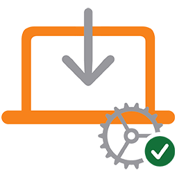
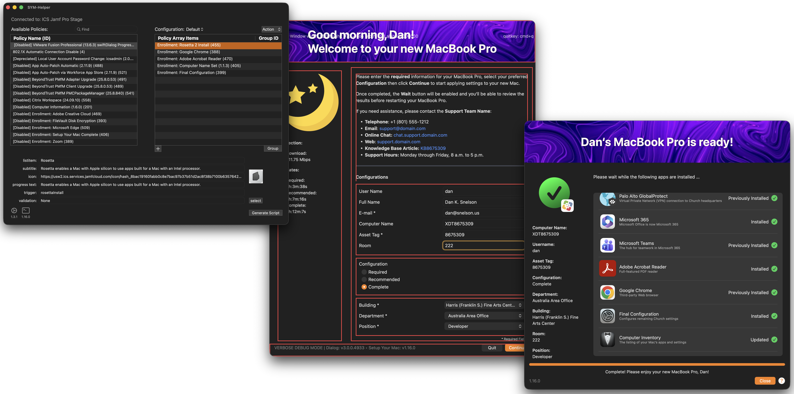
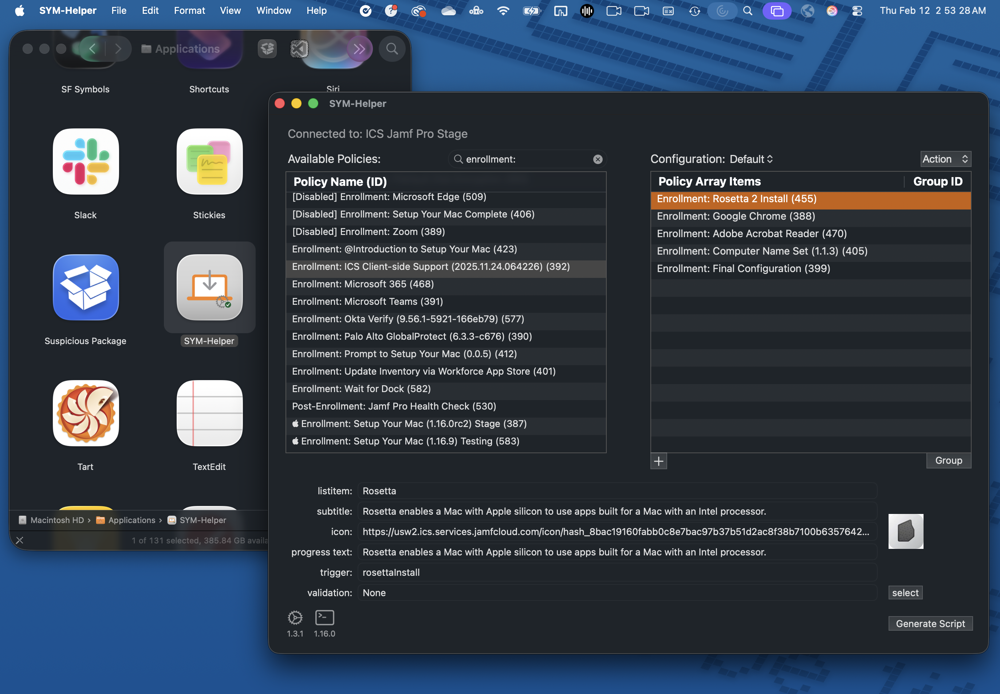

<!-- markdownlint-disable-next-line first-line-heading no-inline-html -->

# Setup Your Mac (1.16.0)   with SYM-Helper (1.3.1)   via swiftDialog (3.0.0)

    

> Optimized to leverage SYM-Helper (1.3.1), Setup Your Mac (1.16.0) offers full support of swiftDialog (3.0.0).

Apple's Automated Device Enrollment helps streamline Mobile Device Management (MDM) enrollment and device Supervision during activation, enabling IT to manage enterprise devices with "zero touch."

**Setup Your Mac** aims to simplify initial device configuration by leveraging `swiftDialog` and Jamf Pro Policy Custom Events to allow end-users to self-complete Mac setup _post-enrollment_.

[Continue reading …](https://github.com/setup-your-mac/Setup-Your-Mac/wiki)

### Script
- [Setup-Your-Mac-via-Dialog.bash](Setup-Your-Mac-via-Dialog.bash)

### Contributors
A special thanks to the ever-growing list of [contributors](CONTRIBUTORS.md); learn how you can [contribute](CONTRIBUTING.md).

---

# SYM-Helper

> A standalone macOS app to help MacAdmins more easily deploy [Setup Your Mac](https://github.com/setup-your-mac/Setup-Your-Mac/wiki)

**NOTE:** When editing [Setup-Your-Mac-via-Dialog.bash](Setup-Your-Mac-via-Dialog.bash), &ldquo;[SYM-Helper]&rdquo; indicates variables that can be configured with SYM-Helper.

[Documentation](https://github.com/setup-your-mac/Setup-Your-Mac/wiki) | [Releases](https://github.com/setup-your-mac/SYM-Helper/releases)

---

# &ldquo;Setup Your Mac, please&rdquo;

> When auto-launching Self Service post-enrollment isn't enough, **continually** prompt your users to _actually_ set up their Macs

While we _thought_ we'd done everything to ensure our users had a seamless experience setting up their new Macs, we recently realized we should **prompt** users whose computers have successfully enrolled but have yet to run our **Setup Your Mac** policy.

[Continue reading …](https://snelson.us/2022/07/setup-your-mac-please/)

### Script
- [Prompt-to-Setup-Your-Mac.bash](Prompt-to-Setup-Your-Mac.bash)
